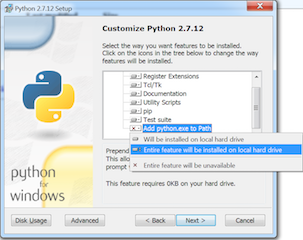
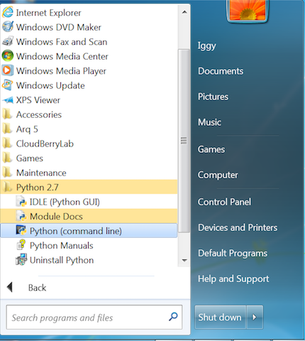
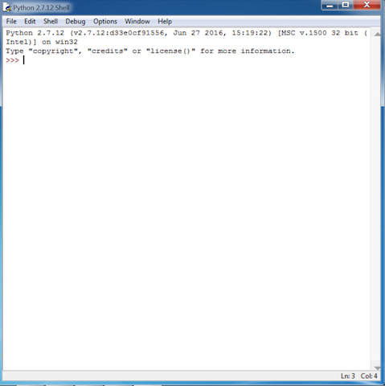

#Igneous 101

##Overview

The goal of this lab exercise is to get you familiar with accessing your on premises Igneous Data Service, so that you can :

* ingest data using a variety of tools
* Understand the enhanced metadata capabilities of an ObjectStore

## CLI related Pre-requisites

Note that depending on network and security conditions, you may also have access to a server which has the needed pre-requisites installed.  One of the lab facilitators will provide you with details in this case.

***Windows users: please skip ahead to the `Windows` section, as the steps you perform will be somewhat different.***

###Mac & Linux

Many of the following steps apply both to Linux as well as OSX.  When there are specific differences between the commands used, you will be directed to either `Linux users`, or `Mac users`

If you are logged into a linux workstation or shared server, some of these tools may already be installed.  Depending on the specific distribution of linux that you are running, some of the commands may differ slightly from what is shown here.  The following assumes you are running RHEL7 or Centos 7.  The main dependancy is python 2.7.x.

At bare minimum, you will need sudo or administrative privileges (to be able to install packages and software).  If you do not have this privilege level, please inform the one of the lab facilitators and they will assist you.

For s3cmd & python exercises, you will need to be familiar with how to open and use a terminal window.

####MISC pre-req's

Not all of these tools are necessary, but are helpful.  Many of you will already have these installed, if so, feel free to skip this section.

* homebrew
* wget
* git
*

####Python pre-req's

1.  Open a terminal window, and create a directory to work in during the lab

		mkdir ~/iggylab && cd ~/iggylab

2.  Next, validate the version of Python that you have.  The scripts you will be using today were written to work with Python 2.7.x.
	a.  Open a terminal, and run:

			python --version
	You should see output similar to:

			Python 2.7.11
	b.  If you see a version number that is _NOT_ 2.7.x, please notify one of the lab instructors and they will help you address the situation.

3.  `Mac users`, skip this step	.  `Linux users` you'll need to get easy_install setup to proceed.
	a.  Run:

			sudo yum install -y python-setuptools

4.  Install 'pip', to allow for installation of additional python modules:
	a.  Open a terminal, and run:

			sudo easy_install pip		

		*This may prompt you for a password, `Mac Users`:
		simply use the password which you use to login to your Mac

	b.  Verify it has been installed:

			which pip

	c.  you should see output such as:

		/usr/local/bin/pip

5.  Get the necessary python modules installed:
	a.  First, boto3:

			sudo pip install --ignore-installed boto3

	b.  Make sure it got installed:

			python -m boto3

	c.  You should see output such as:

			/usr/local/opt/python/bin/python2.7: No module named boto3.__main__; 'boto3' is a package and cannot be directly executed

	If you only see `No module named boto3` , it means it was unable to install.  Please notify one of the lab facilitators.

####s3cmd

There is a simple walkthrough of s3cmd located here:  https://igneoussystemshelp.zendesk.com/knowledge/articles/223409967/en-us?brand_id=1018328

Here is a condensed set of steps to get it installed quickly:

1.  make sure you are in your iggylab folder:

		cd ~/iggylab
2. Download the s3cmd tarball:

		curl -L -O http://downloads.sourceforge.net/project/s3tools/s3cmd/1.6.1/s3cmd-1.6.1.tar.gz
3.  Unpack it and navigate to the folder created:

		tar -xzf s3cmd-*.tar.gz  && cd s3cmd-*
4.  Run the installer:

		sudo python setup.py install

	The final line of output should look like so:

	`Finished processing dependencies for s3cmd==1.6.1`

5.  Assuming you got no errors, run the following to verify that its in place:

		 which s3cmd
	 Output should be similar to:

	`/usr/local/bin/s3cmd`

S3cmd is now installed!

###Windows

Note that this document was written and tested with Windows7 , but should work with Windows10 also.  

####Getting Python installed

1.  Download the python installer:  https://www.python.org/ftp/python/2.7.12/python-2.7.12.msi
2.  Double click to install
	a.  Take defaults, until you get to the `Customize Python 2.7.12` screen
	b.  Make sure to fully install the `Add python.exe to Path` option, as shown below

	

	c.  Hit next and finish, as appropriate.

3.  Check your `Start Menu` (or equivalent) , look for `All Programs -> Python 2.7 -> IDLE (Python GUI)` , eg:

	 

4.  For now, don't launch it, or if you do, close out of it, since we need to install some dependant modules.

####Getting python modules & dependancies

There are a few ways to get python modules installed in Windows, the simplest is to use 'pip'.  Luckily, pip is included with the Python install on windows, and so long as you chose the 'Add python.exe to Path' option, its easy to use.

1.  Open up a Windows cmd prompt (type 'cmd' into the start prompt. Its also available in `All Programs -> Accessories -> Command Prompt`)
2.  Once there:

		pip list
	You should see output similar to:

		pip (8.1.1)
		setuptools (20.10.1)
	*Note: you may also see a message about upgrading pip, you can ignore that for now to save time and keystrokes*
3.  Now you can install the boto3 module:

		pip install boto3

	The last line of output should look similar to this:

		Successfully installed boto3-1.4.0 botocore-1.4.42 docutils-0.12 futures-3.0.5 j
		mespath-0.9.0 python-dateutil-2.5.3 s3transfer-0.1.1 six-1.10.0		
4.  Make sure it got installed:

			python -m boto3

	You should see output such as:

			/usr/local/opt/python/bin/python2.7: No module named boto3.__main__; 'boto3' is a package and cannot be directly executed

5.  For a final check, go ahead and launch `IDLE` , which should give you a window which looks like this:

	

6.  Run the following, to make sure that python can find the module:

		import boto3
	If all is well, you will not get any output to the screen.

You have now got python setup and installed on Windows!

####S3cmd setup

1.  Download the latest zip file from [here](https://github.com/s3tools/s3cmd/archive/master.zip)
2.  Find the file you downloaded in Windows Explorer (usually in `Downloads`), right click, then `Extract all` .  Make sure to change the path to `c:\s3cmd`

	

3.  It will prompt you for where to extract it to, feel free to take the defaults, but make a note of the path you see (copy it into your clipboard to make life easier)

3.  Next you will need to open up your `Command Prompt` window, and change Directories.  EG:

		cd %homepath%\Downloads\s3cmd-master\s3cmd-master

	*Note that if the directory you downloaded the zip file to was not in your Downloads folder, you will need to adjust*
4.  Run the following command to install s3cmd:

		python setup.py install

#overall plan
* ryan's preso
* setup CLI pre-req's
* break
* s3cmd
* python
* Cyberduck

#stuff to add

* put vcard in pre-created buckets
* s3cmd sync
* backup utility? (cloudBerry , etc)
* cut/paste in community
* install atom ?
* survey at the end
* put everything into community.

##Python
* connect
* list_bucket
* list_keys
* upload
* download
* sync (aka: single-threaded os.walk + upload)

* bonus -> more advanced stuff, maybe multi-threaed, etc
* bonus -> crawler that can write to us? pull images, etc..
* copy one of their project mounts, sync that to their bucket (multi-threaded)
