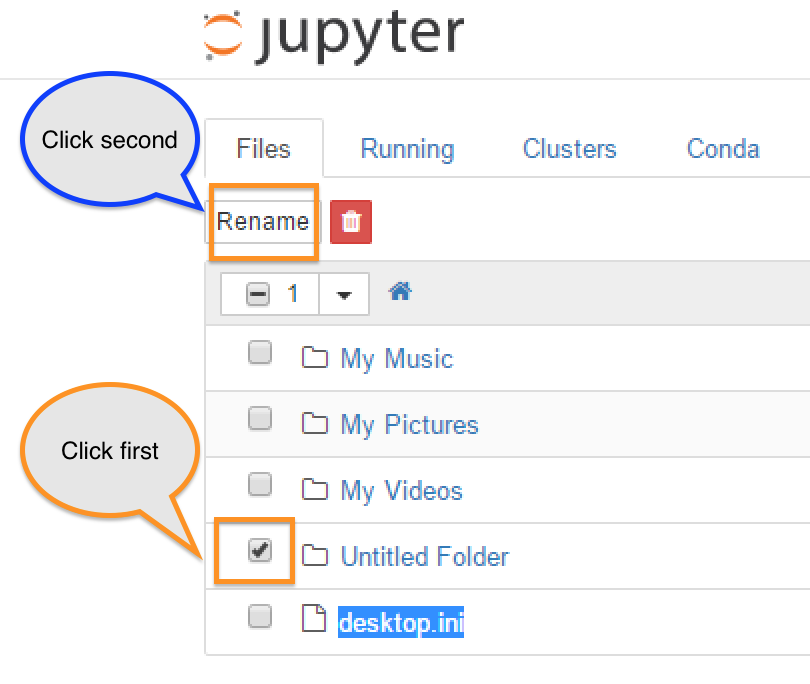

# Python Lab

In this lab you'll get a primer on how to interact with the Igneous Data Service using python and Amazon's `boto3` library.

## Additional documentation

* [Using Boto3 - AWS's SDK for Python](https://igneoussystemshelp.zendesk.com/knowledge/articles/222814587)
* [Boto3 - Retry operations](https://igneoussystemshelp.zendesk.com/knowledge/articles/223204708)
* [Amazon's boto3 doc page for S3](http://boto3.readthedocs.io/en/latest/reference/services/s3.html)
* [Amazon's Boto3 github page](https://github.com/boto/boto3)

## Lab objectives

After you complete this lab and associated exercises, you will have experience:

* Setting up a connection constructor
* Listing buckets/containers
* Listing objects/Keys within a bucket
* Putting a file
* Getting a file
* Getting metadata about an object
* Deleting an object

##  Jupyter notebooks

***Note: if you are comfortable editing scripts and launching them from the command line, code snippets are available here:  https://gist.github.com/zinic/c45e1f9099c2d89f2e4c570e4cb78c78***

Jupyter notebook (the successor to Ipython notebook) enables you to easily get started running and editing python scripts right in your web browser.

### Launching jupyter
**Windows users:**

When installing Anaconda earlier, Jupyter was installed on your machine.  Its accessible from your `All Programs` menu, clicking on the `Jupyter Notebook` icon:

**Mac & Linux users:**

1.  If you haven't already, install jupyter using pip:

        pip install jupyter

2.  To Launch it:

        jupyter notebook

Once you have launched Jupyter notebook, it should launch a web browser pointing to http://localhost:8888 , and should look something like this:

* ***By default on Windows, it will launch into
`C:\Users\%username%\Documents`***
* ***By default on mac & linux, it will launch into the folder where your terminal session was (pwd/cwd)***

### Create a folder for your projects

1.  Navigate to an appropriate folder, and create a new directory:

This will create a folder called `Untitled Folder`

2.  Click the checkbox next to  `Untitled Folder` , then click `Rename`:

3.  
