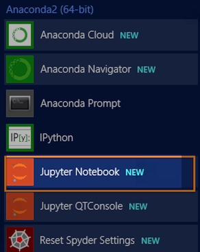
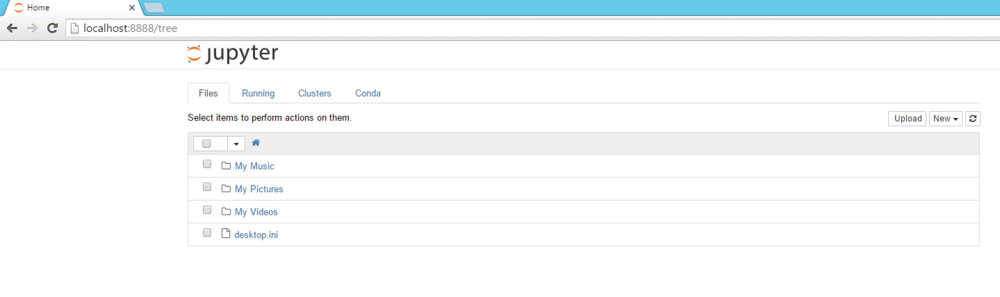
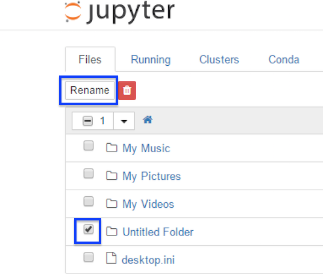
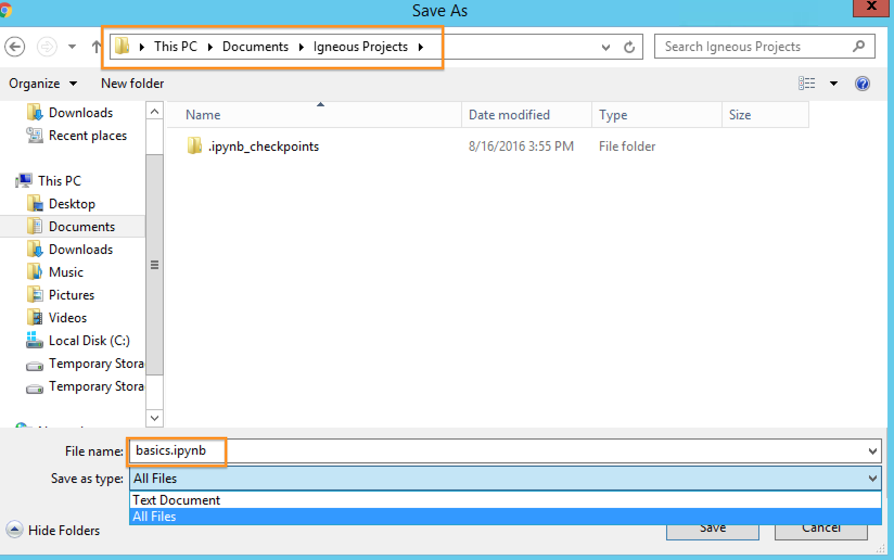
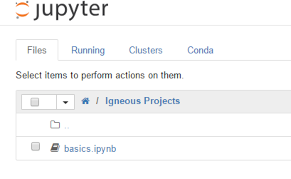
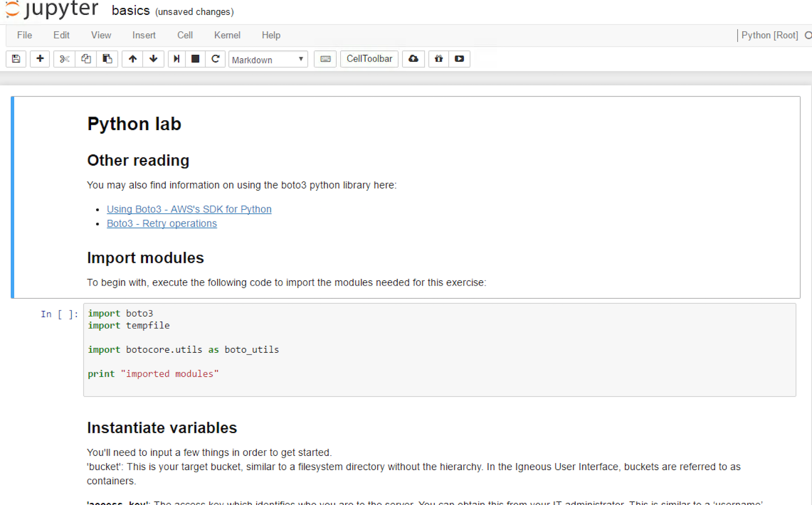
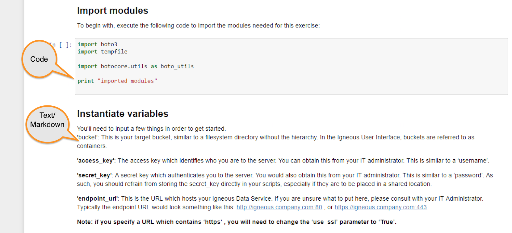
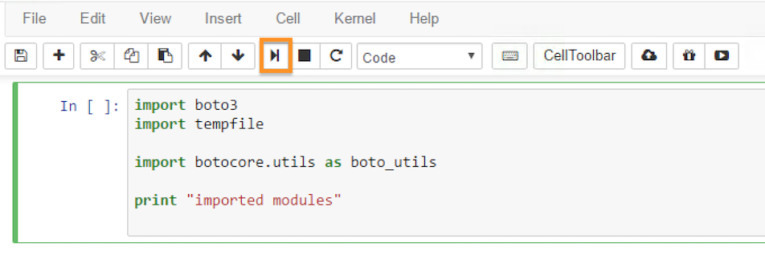

# Python Lab

In this lab you'll get a primer on how to interact with the Igneous Data Service using python and Amazon's `boto3` library.

## Additional documentation

* [Using Boto3 - AWS's SDK for Python](https://igneoussystemshelp.zendesk.com/knowledge/articles/222814587)
* [Boto3 - Retry operations](https://igneoussystemshelp.zendesk.com/knowledge/articles/223204708)
* [Amazon's boto3 doc page for S3](http://boto3.readthedocs.io/en/latest/reference/services/s3.html)
* [Amazon's Boto3 github page](https://github.com/boto/boto3)

## Lab objectives

After you complete this lab and associated exercises, you will have experience:

* Setting up a connection constructor
* Listing buckets/containers
* Listing objects/Keys within a bucket
* Putting a file
* Getting a file
* Getting metadata about an object
* Deleting an object

##  Jupyter notebooks

***Note: if you are comfortable editing scripts and launching them from the command line, code snippets are available here:  https://gist.github.com/zinic/c45e1f9099c2d89f2e4c570e4cb78c78***

Jupyter notebook (the successor to Ipython notebook) enables you to easily get started running and editing python scripts right in your web browser.

### Launching jupyter
**Windows users:**

When installing Anaconda earlier, Jupyter was installed on your machine.  Its accessible from your `All Programs` menu, clicking on the `Jupyter Notebook` icon:

**Mac & Linux users:**

1.  If you haven't already, install jupyter using pip:

        pip install jupyter

2.  To Launch it:

        jupyter notebook

Once you have launched Jupyter notebook, it should launch a web browser pointing to http://localhost:8888 , and should look something like this:

* ***By default on Windows, it will launch into
`C:\Users\%username%\Documents`***
* ***By default on mac & linux, it will launch into the folder where your terminal session was (pwd/cwd)***

### Create a folder for your projects

1.  Navigate to an appropriate folder, and create a new directory:

This will create a folder called `Untitled Folder`

2.  Click the checkbox next to  `Untitled Folder` , then click `Rename`:

3.  Choose a suitable name, like `Igneous Projects`

4.  Click on the link for the folder you just renamed, which should bring you inside the directory

### Download pynotebooks

1.  In a new web browser window or tab, open [basics.ipynb](https://raw.githubusercontent.com/andypern/iggy/master/workshop/iggy101/pynotebook/basics.ipynb)

2.  Once you land on the page, click `File -> Save as` in your browser, and navigate to the folder you created.  `Windows users` make sure to change the file type to `All files` , and ensure that the filename is `basics.ipynb` , without any additional extensions.

3.  Go back to your `Jupyter Notebook` browser/tab , and hit the `Refresh` button.  You should now see `basics.ipynb` show up.

4.  Click on `basics.ipynb` , and you should now be in a notebook!

### Working in a notebook

A notebook is comprised of paragraphs or 'cells'.  A cell will generally be `Markdown` (formatted text), or  `Code` (python).  You can identify a `code` cell by its grey background, eg:

You can make modifications to `code` cells, and in some cases during this lab you will need to.  Simply click inside a `code` cell, and type.

When you want to execute a `code` cell, simply click anywhere inside of it, and click the `play` button:

***Note: during this lab, you should always execute cells in order, starting from top to bottom.  If you make a change in a cell, make sure to execute it before moving to the next cell, as they are dependant on each other***

## Working through the lab

Now that you have everything setup, you're ready to go through the lab.  If you get stuck, waive your lab instructor down and they will help get you going.

## Additional exercises

If you are able to complete the lab and still have time and willingness left over, here are some additional scripts which you can experiment with.  Note they are not in `notebook` format, but you can simply copy/paste code into empty `code` cells in Jupyter.

* [backup_to_IGNEOUS.py](https://github.com/andypern/iggy/blob/master/workshop/iggy101/advanced/backup_to_IGNEOUS.py) : a script which scans a folder on your local filesystem, and uploads everything to Igneous.  *Single threaded*
