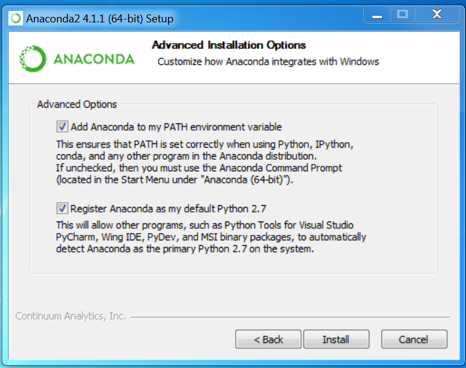
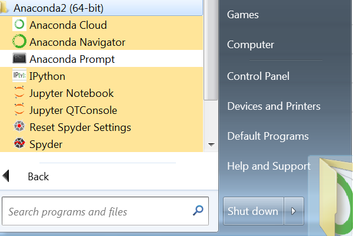
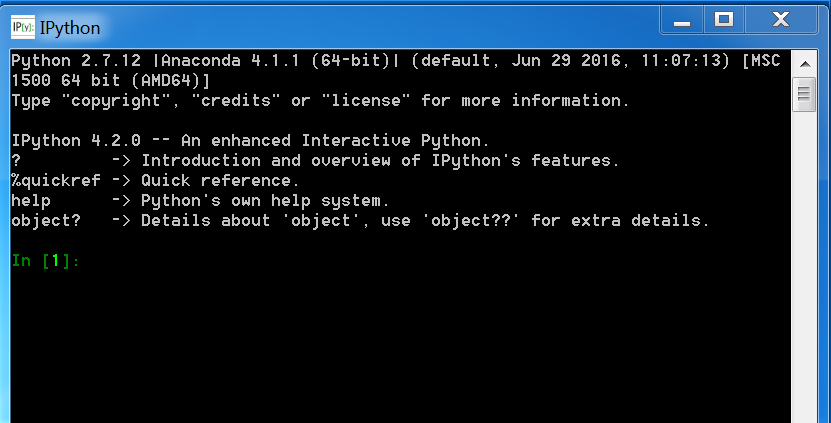
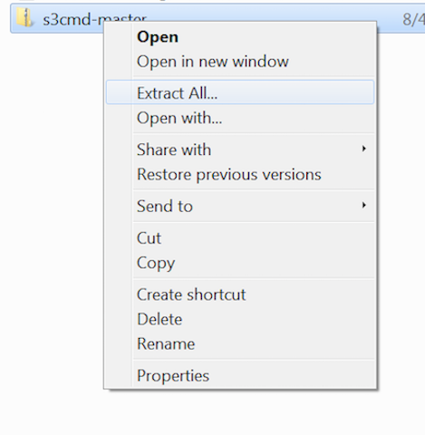

# Windows pre-requisites

Note that this document was written and tested with Windows7 , but should work with Windows10 also.  

## Getting Python installed

1.  Grab the anaconda installer for python 2.7: http://repo.continuum.io/archive/Anaconda2-4.1.1-Windows-x86_64.exe
2.  Take all defaults.  Make sure on the 'Advanced Installation Options' page you leave both boxes Checked as shown below:

	

	*Note: this may take several minutes to install*

3.  Once its installed, you should see an 'Anaconda2' folder in your Start menu under 'All Programs':

	

4.  To verify all is well, click on the 'Anaconda Prompt' icon, which should launch a command window.  Type the following into it:

	python --version

You should see something similar to:

	Python 2.7.12 :: Anaconda 4.1.1 (64-bit)

## Getting python modules & dependancies

There are a few ways to get python modules installed in Windows, the simplest is to use 'pip'.  Luckily, pip is included with the Anaconda install on windows.

1.  Go to your Anaconda Prompt window. (`All Programs -> Anaconda2 -> Anaconda Prompt`)
2.  Once there, type:
		pip install boto3

	The last line of output should look similar to this:

		Successfully installed boto3-1.4.0 botocore-1.4.43 jmespath-0.9.0 s3transfer-0.1.1

3.  For a final check, go ahead and launch `All Programs -> Anaconda2 -> Ipython` , which should give you a window which looks like this:

	

4.  In that window, type the following and hit the `<enter>` key:

		import boto3
	If all is well, you will not get any output to the screen.  This means that the boto3 library was successfully installed and is able to be loaded into the Python environment.

You have now got python and dependancies setup and installed on Windows!

#### S3cmd setup

1.  Download the latest zip file from [here](https://github.com/s3tools/s3cmd/archive/master.zip)
2.  Find the file you downloaded in Windows Explorer (usually in `Downloads`), right click, then `Extract all` .  Make sure to change the path to `c:\s3cmd`

	

3.  It will prompt you for where to extract it to, feel free to take the defaults, but make a note of the path you see (copy it into your clipboard to make life easier)

3.  Next you will need to open up your `Anaconda Prompt` window, and change Directories.  EG:

		cd %homepath%\Downloads\s3cmd-master\s3cmd-master

	*Note that if the directory you downloaded the zip file to was not in your Downloads folder, you will need to adjust*
4.  Run the following command to install s3cmd:

		python setup.py install

5.  In the same `Anaconda` window, you should be able to run the following :

	python s3cmd --version

It should return something like this:

	s3cmd version 1.6.1

 To make it easy to run s3cmd in the future, you're going to create a quick .bat file.  

1.  Open up `notepad`
2.  Put the following text in:

	python.exe %homepath%\s3cmd-master\s3cmd %*
3.  Save the file into `c:\Anaconda2` , and name it `s3cmd.bat`

	***Make sure to change the 'Save as type' to 'all files'***

	
